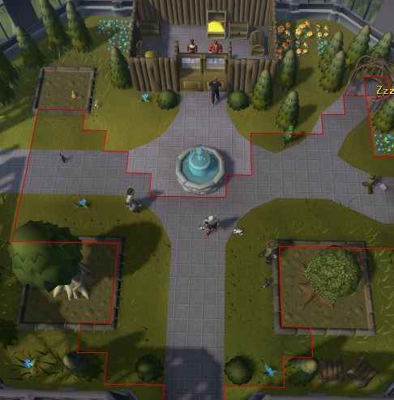
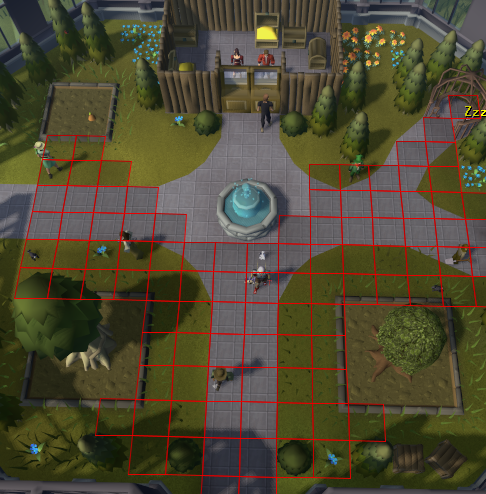
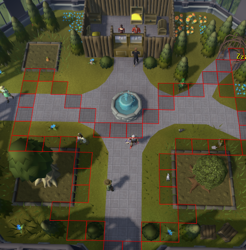

# Attack Ranges

Displays the attack range of your currently equipped weapon.

## Functionality
Automatically displays the attack range for your equipped weapon.

Will update dynamically if your attack style or weapon changes.

Configure a hotkey to display on toggle or hold.

### NPC Highlighting
Highlight NPCs in your attack range

### Drag Protection
Hide the attack option for NPCs outside your attack range

## Styling
### Display Mode
#### Border
Render an outline of the attackable area

#### Tiles
Render every tile you can attack

#### Edge Tile
Render only the outermost tiles of your attack range

